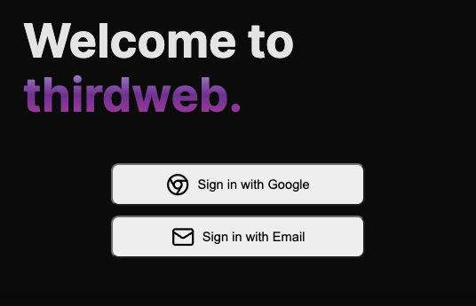

# Embedded Wallets with Custom UI

This repo showcases how you can build your own UI to connect users to [embedded wallets](https://portal.thirdweb.com/embedded-wallet) using email or google sign in.



## Live Demo

[Try out the live demo here](https://embedded-wallet-custom-ui.thirdweb-preview.com/)

## Getting Started

Clone this project or create a new project using this template:

```bash
npx thirdweb create --template embedded-wallet-custom-ui
```

You can start editing the page by modifying `pages/index.tsx`. The page auto-updates as you edit the file.

On `pages/_app.tsx`, you'll find our `ThirdwebProvider` wrapping your app, this is necessary for our [hooks](https://portal.thirdweb.com/react) and
[UI Components](https://portal.thirdweb.com/ui-components) to work.

## Environment Variables

To run this project, you will need to add environment variables. Check the `.env.example` file for all the environment variables required and add it to `.env.local` file or set them up on your hosting provider.

## Runing the project

Install dependencies

```bash
yarn install
```

Run project

```bash
yarn dev
```

Open your browser at http://localhost:3000.

## Learn More

To learn more about thirdweb and Next.js, take a look at the following resources:

- [thirdweb Embedded Wallet Documentation](https://portal.thirdweb.com/embedded-wallet) - learn about our Embedded Wallets.
- [thirdweb React Documentation](https://docs.thirdweb.com/react) - learn about our React SDK.
- [thirdweb TypeScript Documentation](https://docs.thirdweb.com/typescript) - learn about our JavaScript/TypeScript SDK.
- [thirdweb Portal](https://docs.thirdweb.com) - check our guides and development resources.
- [Next.js Documentation](https://nextjs.org/docs) - learn about Next.js features and API.
- [Templates](https://thirdweb.com/templates)

You can check out [the thirdweb GitHub organization](https://github.com/thirdweb-dev) - your feedback and contributions are welcome!

## Join our Discord!

For any questions, suggestions, join our discord at [https://discord.gg/thirdweb](https://discord.gg/thirdweb).
